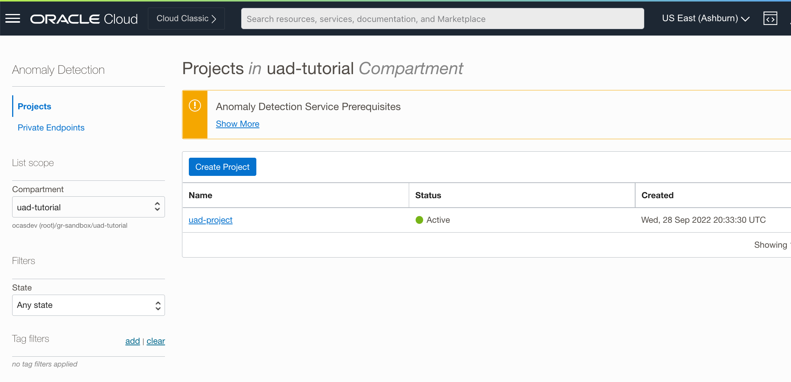
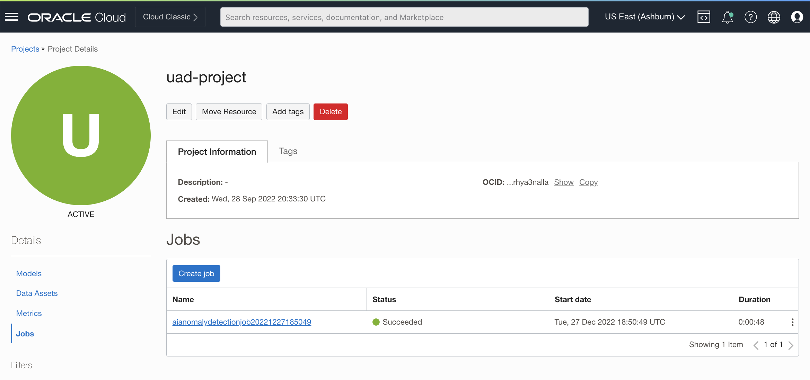
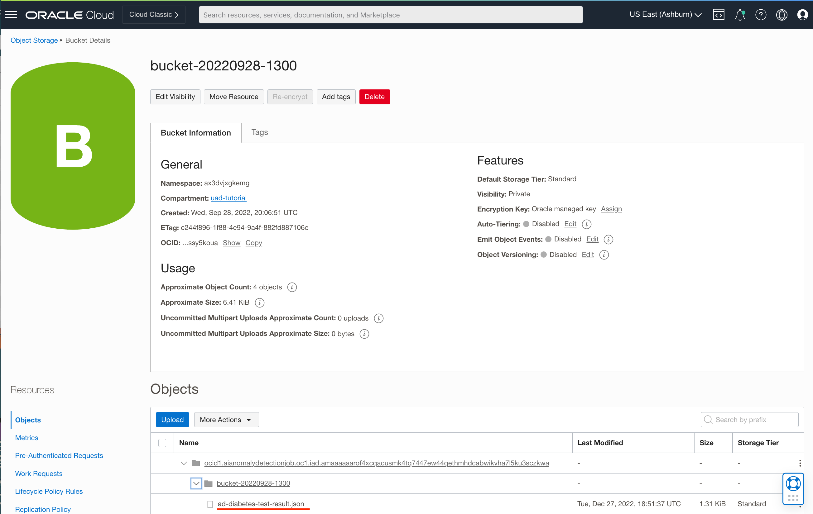

# Detect Anomalies using Async Inference Feature

This tutorial details the steps for detecting anomalies in inference data sets using OCI Anomaly Detection Service **Asynchronous Inference** feature.

The terms **Detecting Anomalies** and **Inferencing** are used interchangably in the remainder of this tutorial to mean one and the same thing - Detecting anomalies in time series data.

*Asynchronous Inference* feature can be used to detect anomalies in both Univariate and Multivariate inference data sets.

Typical use cases and/or scenarios suited for Asynchronous Inferencing are described below.

- **Detect anomalies in very large data sets**

  The maximum number of data points supported by the *detectAnomalies* REST API (Synchronous API) is 30K.  This may impose restrictions in anomaly detection scenarios where a large number of data points typically in the millions need to be inferenced. Using Asynchronous inference, users can analyze and detect anomalies in very large data sets ~ 10 million data points.

- **Automate inference workflows**

  In IoT use cases, time series data is usually collected from large number of  sensors/devices and stored in a persistent data store such as a database or a file system.  Oftentimes, this raw data has to be pre-processed (enriched) using PaaS Services such as OCI Data Flow, prior to performing inferencing. Users can easily integrate asynchronous inference API's within data processing pipelines and automate inference workflows.
  
- **Post-process anomalous events**

  In certain anomaly detection scenarios, the inferenced data (detected anomalies) may need to be transformed or enriched before it can be consumed by downstream applications. With Asynchronous inference, detected anomalies are saved in an OCI Object Store location (Bucket).  Users can therefore use PaaS services such as OCI Data Flow to analyze, process and/or enrich the anomalous events. Furthermore, the anomalies can also be easily consumed and rendered on vizualization graphs in Oracle Analytics Cloud to allow users to monitor target systems and take corrective actions.

At a high level, the process for detecting anomalies using Asynchronous inferencing involves the steps outlined below.
- Training a model with a **Training** data set.
  Refer to the other tutorials for training an anomaly detection model.
- Detect anomalies with an **Inference** data set.
  Use the Asynchronous Inference API (AD Service SDK) or OCI Console to create an Asynchronous Job.

In this tutorial, we will use the OCI Console for creating an Asynchronous Inference Job. The steps are outlined below.

1. [Upload Inference data set to an OCI Object Store Bucket](#1-upload-inference-data-set-to-an-oci-object-store-bucket)
2. [Create an Asynchronous Job](#2-create-an-asynchronous-job)
3. [Review Anomaly Detection Results](#3-review-anomaly-detection-results)

## Before You Begin
To work on this tutorial, you must have the following
- A paid Oracle Cloud Infrastructure (OCI) account, or a new accont with Oracle Cloud Promotions.  See [Request and Manage Free Oracle Cloud Promotions](https://docs.oracle.com/en-us/iaas/Content/GSG/Tasks/signingup.htm).
- Administrator privilege for the OCI account
- At least one user in your tenancy who wants to access Anomaly Detection Service. This user must be created in [IAM](https://docs.oracle.com/en-us/iaas/Content/Identity/Tasks/managingusers.htm)

## Pre-requisites
- By default, only users in the **Administrators** group have access to all Anomaly Detection resources. If you are not an admin user, you will need to request your administrator to create OCI policies and assign them to your group.  Please refer to the instructions in the [About Anomaly Detection Policies](https://docs.oracle.com/en-us/iaas/Content/anomaly/using/policies.htm) page.
- You must have a compartment which you will be using to provision required resources while going through the labs in this tutorial. Refer to OCI documentation to learn about [Managing Compartments](https://docs.oracle.com/en-us/iaas/Content/Identity/Tasks/managingcompartments.htm).

**IMPORTANT**: Before proceeding, make sure you have trained an Anomaly Detection Model by following the steps in the Univariate Anomaly Detection tutorial.

## 1. Upload Inference Data Set to an OCI Object Store Bucket

   1. Login to [OCI Console](https://cloud.oracle.com) using your credentials
         
      After logging into OCI, you should see the home web page as shown in the screenshot below.
         
      

   2. Store the inference data set in OCI Object Store Bucket

      Download one of the sample inference data sets from the [Univariate Tutorial](https://github.com/ganrad/oci-ai-services/tree/main/oci-ai-ad-uad#2-review-time-series-data-sets) and save it locally on your workstation. For the purposes of this tutorial, we will be using the inference data set for **Use Case No. 4** (Monitor Blood Glucose Levels).  This use case pertains to detecting abnormal blood glucose levels (anomalies) in a patient's blood data. In case you trained the anomaly detection model with a different data set, check to make sure you are using the corresponding inference data set.

      Click on the hamburger icon on the top left and then click on **Storage** in the display menu.  See screenshot below.

      

      Then click on **Buckets** under **Object Storage & Archive Storage**.  This will take you to the **Buckets** page as shown in the screenshot below.

      

      Click on **Create Bucket** button to create a new Bucket for storing training data files. You can either use the default name or specify a name for the bucket.  Leave the other fields as is and then click on **Create**.  The new bucket should get created and be listed in the *Buckets* page as shown in the screenshot below.

      

      In the **Buckets** page, click on the bucket (link) which you created in the previous step. Under Objects, click on the **Upload** button. In the *Upload* Objects panel, specify a name for the file (optional) you want to upload to OCI Object Storage. Then select the inference file from your local directory and click **Upload**. Once the file gets uploaded, click on the **Close** button to close the file upload panel. The uploaded file should be listed in the *Objects* page as shown in the screenshot below.
       
      

## 2. Create an Asynchronous Job

   1. Select the **Project** containing the trained model

      Go to *Anomaly Detection Service* and select the **Project** containing the pre-trained Univariate model.  See screenshot below.

      
      
      In the left resources panel under *Details*, click on **Jobs**.  See below.

      

   2. Create an **Async Job**

      Click on **Create job** as shown in the screenshot below.

      

      Refer to the table below to specify correct values for the fields in the **Create job** wizard.

      | Field Name | Description | Optional (Yes/No)
      | ---------- | ----------- | -----------------
      | Compartment | OCI Compartment Name. Leave the default value as is. | No
      | Name | Name of the Async job | Yes
      | Description | Brief description of the job | Yes
      | Model | Anomaly Detection Model Name. Select the anomaly detection model which you created in the *Univariate* AD Tutorial | No
      | Input request | Request type. Select *Object store* from the drop-down control. Alternatively, you can also select *Inline* from the drop-down control. In this latter case, you can detect anomalies in an inference data set by selecting the corresponding data file from your local workstation. | No
      | Input bucket | Input OCI Object Storage Bucket Name. Select the OCI Object Store Bucket in which you have saved the inference data set. In case you selected *Inline* for **Input request**, click on **Select File** to choose an inference data set (file) saved on your local workstation.  For the purpose of this tutorial, we will select the inference data set (file) saved in a OCI Object Store bucket. | No
      | Inference data | Inference data set file. Select the Inference data set (file) which you saved to OCI Object Store Bucket in Section [1] above. | No
      | Output bucket | Output OCI Object Storage Bucket Name. Select the OCI Object Store Bucket where you want the service to save anomaly detection results. | No

      See the screenshot below.  After verifying all information, click on **Create job**.  This will start the Async inference job.

      

      The Async Job **Status** will initially display a value of *Accepted*. The Job status will switch to *In Progress* once the Job starts running and finally when the Job finishes it's status will change to *Succeeded*. As our inference data set is relatively small, the Async Job should finish within a minute or so. See screenshot below.

      

      Click on the completed Async Job to view it's details as shown in the screenshot below.

      

## 3. Review Anomaly Detection Results
   
   1. Access the anomaly detection results JSON file

      Follow the steps described in Section [1] above to access the **Output** OCI Object Store *Bucket*.

      The anomaly detection results file would be saved under a separate directory/folder in OCI Object Store Bucket using the following naming convention **Model-OCID/Output-Bucket-Name**, where *Model-OCID* is the OCI ID of the Anomaly Detection *Model* and *Output-Bucket-Name* is the OCI Object Store Bucket *Name*.  The anomaly detection results file *Name* will be the same as inference data set file name suffixed with **-results**. See screenshot below.

      

   2. Review and confirm detected anomalies

      Download the anomaly detection results JSON file to your local workstation. See screenshot below.

      

      Open the file and verify the detected anomalous events (metric values).

You have now successfully completed this tutorial.  Explore the Asynchronous Inference feature by using your own time-series inference data sets to create Asynchronous Jobs and perform inference.
