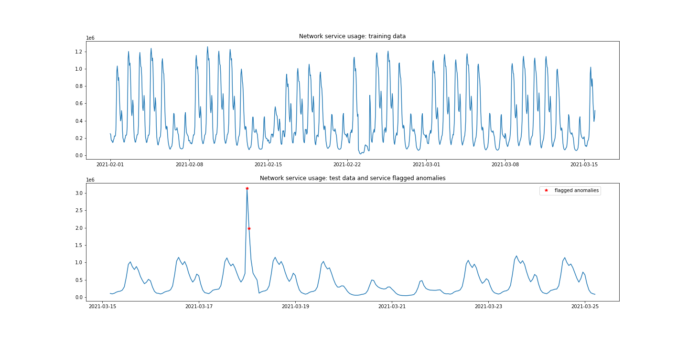
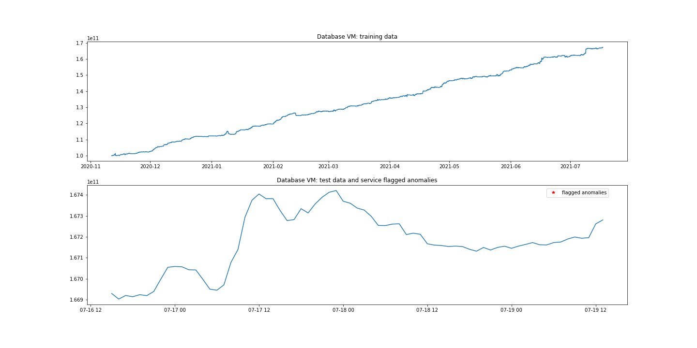
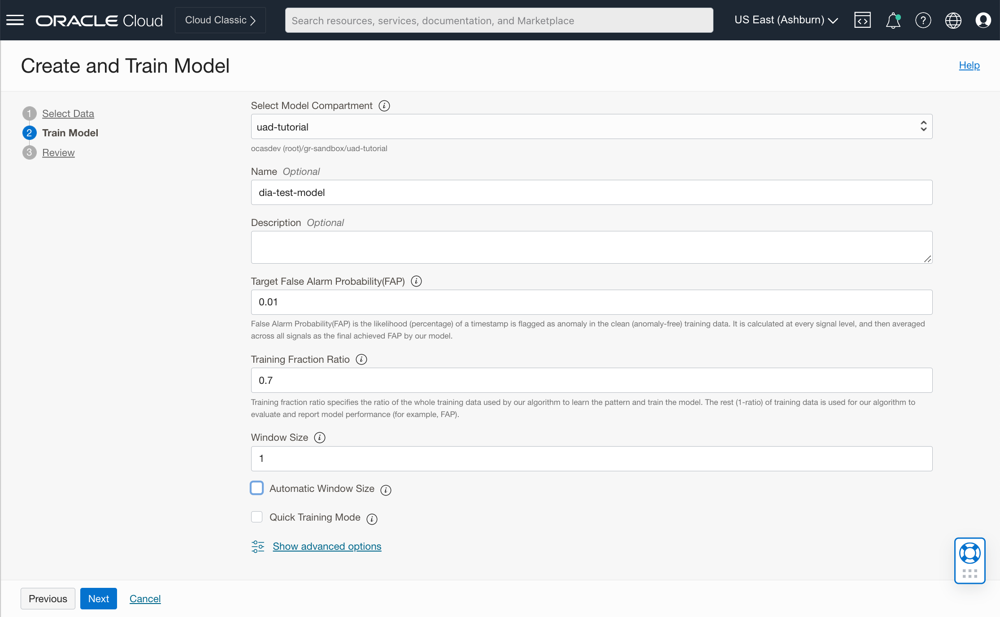
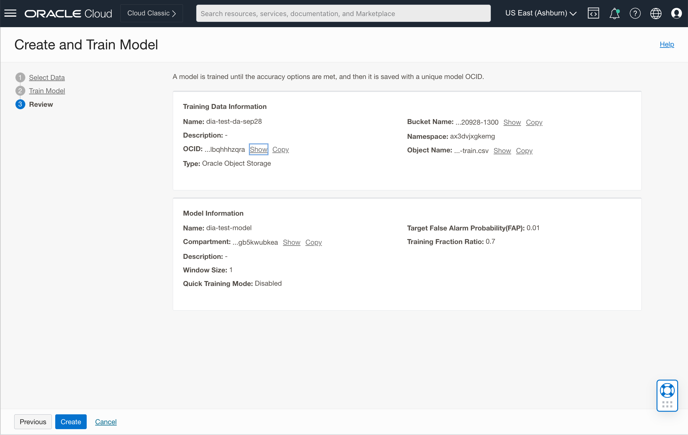
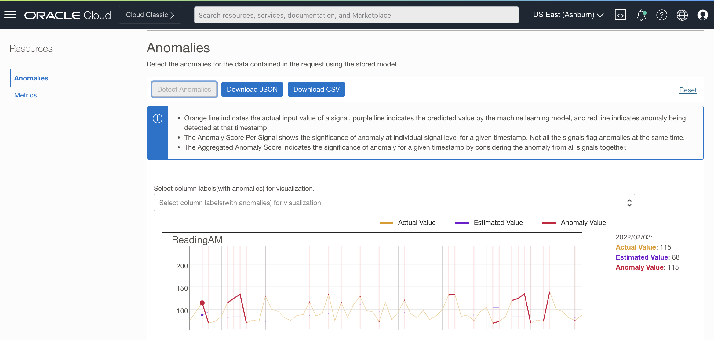

# Detect Anomalies in Univariate Time Series Data

This tutorial details the steps for detecting anomalies in **Univariate** signals using *OCI Anomaly Detection Service*.

Univariate anomaly detection (UAD) refers to the problem of identifying anomalies in a single time series data.  A single time series data contains timestamped values for one signal (a.k.a metric or measure).

OCI Anomaly Detection Service offers two workflows for detecting anomalies in Univariate time series signals.  This tutorial will focus on detailing the steps for using the *Train Model and Detect* (TMD) workflow.

At a high level, the process for detecting anomalies in time series data using TMD workflow involves two simple steps outlined below.
- Training a model with a **Training** data set.
  The training data set should ideally not contain any anomalies. It should contain values that were collected when the monitoried system/asset was operating under normal conditions.  It's ok to include data values that represent normal seasonal trends & other values that represent normal conditions. 
- Using the trained model to detect anomalies with an **Inference** data set.
  The inference data set contains timestamped data values for a given signal typically collected by a sensor or software agent which is monitoring a physical or virtual system/asset in real-time.

With OCI Anomaly Detection Service, users can
- Train univariate anomaly detection models using different types of univariate time series data (See Section 1 below)
- Detect different types of anomalies in time series data such as point, range and contextual anomalies (Refer to Section 1 below)
- Train models for up to 300 univariate signals using one data set stored in an OCI Object Store file or OCI Autonomous Database table
- Infer upon or detect anomalies in 300 individual time series data (~ signals) using a single **detect anomalies** API call

In this tutorial, we will go thru the following steps.

1. Review Univariate Time Series Data patterns and Anomaly types
2. Review Time Series Data Sets
3. Train an Anomaly Detection Model
4. Detect Anomalies and Verify Results

## Before You Begin
To work on this tutorial, you must have the following
- A paid Oracle Cloud Infrastructure (OCI) account, or a new accont with Oracle Cloud Promotions.  See [Request and Manage Free Oracle Cloud Promotions](https://docs.oracle.com/en-us/iaas/Content/GSG/Tasks/signingup.htm).
- Administrator privilege for the OCI account
- At least one user in your tenancy who wants to access Anomaly Detection Service. This user must be created in [IAM](https://docs.oracle.com/en-us/iaas/Content/Identity/Tasks/managingusers.htm)

## Pre-requisites
- By default, only users in the **Administrators** group have access to all Anomaly Detection resources. If you are not an admin user, you will need to request your administrator to create OCI policies and assign them to your group.  Please refer to the instructions in the [About Anomaly Detection Policies](https://docs.oracle.com/en-us/iaas/Content/anomaly/using/policies.htm) page.
- You must have a compartment which you will be using to provision required resources while going through the labs in this tutorial. Refer to OCI documentation to learn about [Managing Compartments](https://docs.oracle.com/en-us/iaas/Content/Identity/Tasks/managingcompartments.htm).

## 1. Review Univariate Time Series Data patterns and Anomaly types
   OCI Anomaly Detection Service can detect anomalies in different types/patterns of Univariate time series data.  Furthermore, the service can identify different types of anomalies in the data with minimal false alarms.

   The Section below describes the time series data patterns and anomaly types detected by OCI Anomaly Detection Service.

   - A data set containing seasonal patterns.

     OCI Anomaly Detection Service detects spikes and dips in time series data containing seasonal patterns. The univariate kernel does automatic window size detection and as a result anomalous spikes are detected as soon as they occur (no delay) with high precision as shown in the train and test graphs below.

     

   - A flat trend (or constant) data set.

     OCI Anomaly Detection Service detects anomalies in flat (or constant) trend data as shown in the train and test graphs below. 

     

   - A continuously increasing linear trend data set.

     OCI Anomaly Detection Service identifies increasing linear trends in data values and as such doesn't flag anomalies (No false alarms!) as shown in the graphs below. 
    
     

   - A linear trend data set.

     OCI Anomaly Detection Service detects spikes and dips (anomalous values) in linear time series data. See graphs below.

     

## 2. Review Time Series Data Sets
   In this Section, we will review time series data patterns along with types of anomalies which can be detected by OCI Anomaly Detection Service.

   | ID | Use Case | Description | Data Pattern | Anomaly Type | Anomalous Values | Data Sets
   -- | -------- | ----------- | ------------ | ------------ | ---------------- | ---------
   |  1 | Monitor Network Service Usage | Identify anomalies in network service metrics - Bytes received/transmitted | Seasonal trend | Spikes | Values above 1.5 Kbps | [Train Data Set](./data/network_svc_usage_train.csv) [Inference Data Set](./data/network_svc_usage_test.csv)
   |  2 | Monitor Compute Service Usage | Service doesn't identify anomalies (occasional spikes) in memory consumption (compute metric) as it fluctuates over time based on system load | Increasing Linear trend | Spikes | | [Train Data Set](./data/database_vm_train.csv) [Inference Data Set](./data/database_vm_test.csv)
   |  3 | Monitor Dashboard metrics | Identify spike and dip anomalies in the process of user loading data into a dashboard | Increasing or Decreasing Linear trend | Spikes and Dips | | [Train Data Set](./data/dashboard_metric_train.csv) [Inference Data Set](./data/dashboard_metric_test.csv)
   |  4 | Monitor Blood Glucose Levels | Identify abnormal blood glucose levels | No trend | Point | High glucose levels > 120 mg/dL and lows < 80 mg/dL | [Train Data Set](./data/ad-diabetes-train.csv) [Inference Data Set](./data/ad-diabetes-test.csv)
   |  5 | Flat trend | Identify anomalous values among constant values | Flat trend | Spikes | | [Train Data Set](./data/simple_flat_syn_train.csv) [Inference Data Set](./data/simple_flat_syn_test.csv)

   Before proceeding with the next step, click on the data sets which you want to use/explore for training Univariate AD models and save them to your local hard drive (on your PC). Also, download and save the corresponding Test/Inference data sets as well.

## 3. Train an Anomaly Detection Model
   In this Section, we will train an anomaly detection model using OCI Console.
   
   1. Login to [OCI Console](cloud.oracle.com) using your credentials.

      After logging into OCI, you should see the home web page as shown in the screenshot below.

      

   2. Select and store a training data set in OCI Object Store Bucket

      In this step, we will store training data set for use case #4 (Monitor Blood Glucose Levels) in OCI Object Store Bucket and then use it to train an Anomaly Detection *Model*. This data set contains normal blood glucose readings collected over a period of 3 to 4 months.

      The trained model will then be used to infer high or low glucose values (anomalies) in a test data set in Section [4].

      This example along with the sample data set showcases how OCI Anomaly Detection Service automatically infers upper and lower bounds for a given data set that contains no seasonal or cyclic patterns and trains a model to detect values (point anomalies) that fall outside the nominal range.

      Readers can review and select any data set from Section [2] to train an AD model, understand the data pattern, run inference and verify test results. Readers can also use their own training and inference data sets.

      Click on the hamburger icon on the top left and then click on **Storage** in the display menu.  See screenshot below.

      

      Then click on **Buckets** under **Object Storage & Archive Storage**.  This will take you to the **Buckets** page as shown in the screenshot below.

      
 
      Click on **Create Bucket** button to create a new *Bucket* for storing training data files. You can either use the default name or specify a name for the bucket. Leave the other fields as is and then click on **Create**. The new bucket should get created and be listed in the *Buckets* page as shown in the screenshot below.

      

      In the **Buckets** page, click on the bucket (link) which you created in the previous step. Under *Objects*, click on the **Upload** button.  In the *Upload Objects* panel, specify a name for the file (optional) you want to upload to OCI Object Storage. Then select the training file from your local directory and click **Upload**. Once the file gets uploaded, click on the **Close** button to close the file upload panel. The uploaded file should be listed in the *Objects* page as shown in the screenshot below.

      

   3. Train an Anomaly Detection Model
   
      Click on the hamburger icon on the top left and then click on **Analytics and AI** in the menu.  Then click on **Anomaly Detection** under **AI Services**. See Screenshow below.

      

      You should now see the Anomaly Detection Service *Projects* page as shown in the screenshot below.

      

      A *Project* resource in OCI Anomaly Detection Service serves as a container for storing resources such as *Data Assets*, *Models* and *Async Jobs*.

      Click on the **Create Project** button to create a new *Project*. Give the new project a name and a description and then click on **Create**.  The project will get created and be listed in the **Projects** page as shown in the screenshot below.

      

      Next, click on the project (link) you just created.  In the project details page, click on **Create and Train Model** button.  This should start the *Create and Train Model* wizard.

      A **Data Asset** resource in OCI Anomaly Detection Service is used to store the location (a pointer) of a model training file.  The model training file can be sourced from an **OCI Object Store Bucket**, an **OCI Autonomous Database** (ATP / ADW) or an **InfluxDB collection**.

      In this tutorial, we will be using a file stored in OCI Object Store Bucket to train the Univariate model.

      In the **Select Data** step in the wizard, select the **Create a new data asset** radio button. This will bring up the **Create Data Asset** panel.  Give a name and description (both fields are optional) to the data asset and select **Oracle Object Storage** in the **Type** field. Select the bucket followed by training file which you created in Step [2]. See screenshot below.

      

      Click **Create** button to create the data asset. This should bring you back to the wizard.  Click **Next** and on the **Train Model** page, optionally provide a name and description for the model.

      Anomalies are usually explainable only in the context of past events within a time series.  The *Window Size* parameter is used to set this contextual time window.  When **Automatic Window Size** option is selected, the service automatically computes the window size value.  However, in the case of use case #4, we are trying to detect *Point* anomalies and as such there is no need to look back at past events.

      Uncheck the checkbox for **Automatic Window Size** and specify a value of 1 for **Window Size**.

      Leave the default values for other fields as is. See screenshot below.

      

      Click **Next**. On the next page, review all the information. See screenshot below.

      

      Lastly, click **Create** to start model training. This step will take a few minutes to complete.  Be patient and grab a coffee or a cookie.

      You can view the status of the model in the **Models** page as shown in the screenshot below.

      

      Proceed to the next Step [4] as soon as the model status changes to **Active**. See screenshot below.

      

## 4. Detect Anomalies and Verify Results

   In this Section, we will 
   - Use the trained model to detect anomalies in an inference data set (provided in Section [2])
   - Verify Anomaly Detection results

   The inference data sets provided in Section [2] contain anomalous values. We will use the inference data set for use case #4 for detecting anomalies.

   1. Run Inference 

      First, click on the model which you created in Section [3] listed in a table under **Anomaly Detection Models**.  See screenshot below.

      

      Click on **Detect Anomalies** in the **Anomalies** page.  In the **Detect Anomalies** window, click on **Select File** and pick the inference data file which you downloaded in Section [2] for use case #4.

      Leave the **Sensitivity** field value empty for the initial run. When no value is specified, the default sensitivity value of 0.5 will be used.  In the next step, we will change this value and see how it affects the number of anomalies detected. See screenshot below.

      

      Click on **Detect** button.  Anomaly detection results will be rendered as graphs as shown in the screenshot below.

      

      In reviewing the detect results graph, you might have noticed that the service has flagged a normal value as 
